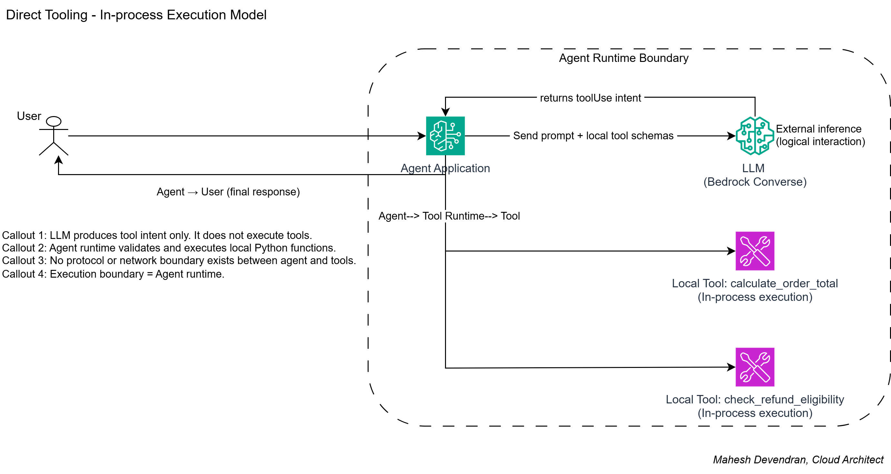
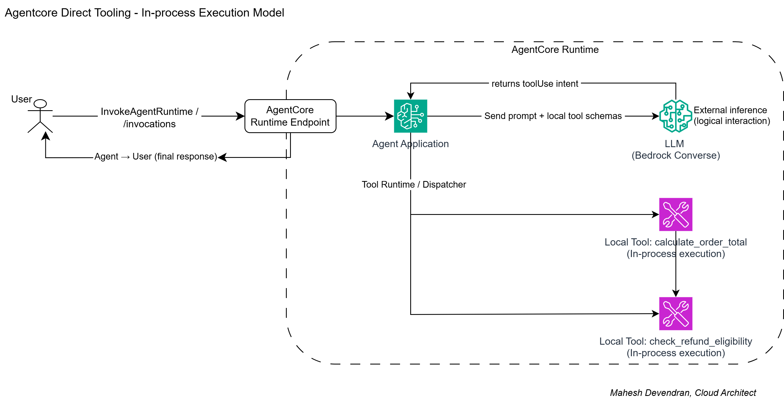
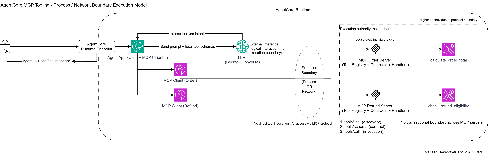
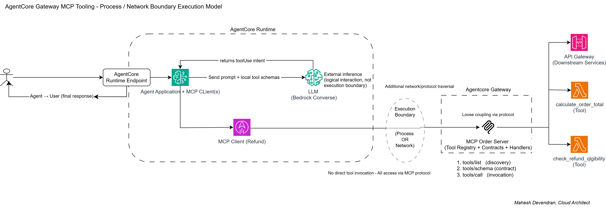
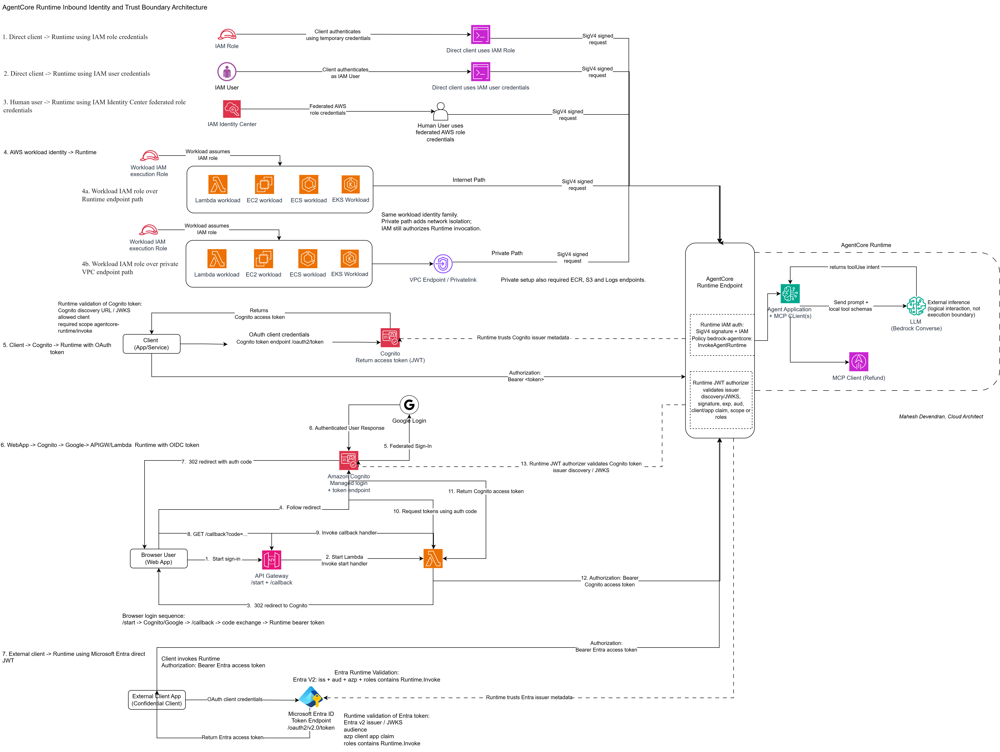
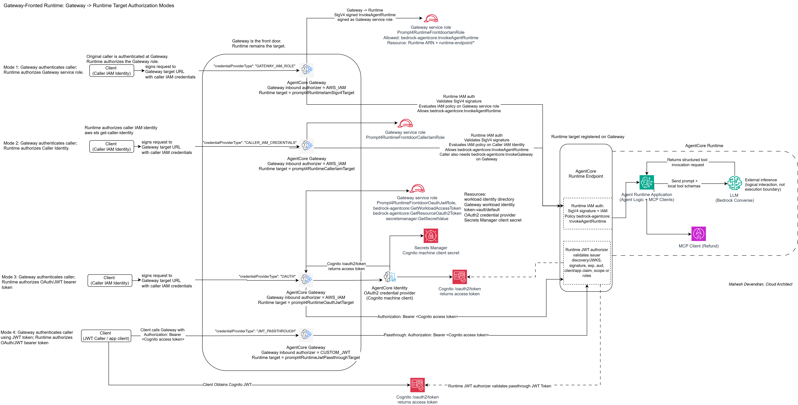

# Agentic Runtime Architecture

Architecture patterns for building secure, observable, and governed LLM agent runtimes.

This repository contains proof-driven architecture patterns for LLM agents built around direct tools, MCP execution boundaries, Amazon Bedrock AgentCore Runtime, AgentCore Gateway, Runtime inbound identity, and production hardening controls.

Most agent discussions start with tool calling: schemas, selection, invocation, and results. In production, the harder architectural question is where execution happens, whose identity is used, and which boundary is trusted when reasoning becomes action.

These examples are intentionally small, but each pattern proves a specific boundary:

- where tool execution authority resides
- where tool contracts and validation live
- how failures propagate across boundaries
- how Runtime, Gateway, and target services divide responsibility
- how inbound identity and trust are enforced for AgentCore Runtime

## Author

**Mahesh Devendran** - Cloud Architect focused on secure, scalable, and identity-driven AI platforms across AWS, Azure, and GCP.

My work focuses on zero-trust data access patterns, serverless architecture, AI-driven architectures, predictable resilient systems, and regulated-industry workloads where correctness and clarity matter most.

- LinkedIn: [mahesh-devendran](https://www.linkedin.com/in/mahesh-devendran-83a3b214/)
- Medium: [@mahesh.devendran](https://medium.com/@mahesh.devendran)

## Architecture Progression

```text
Stage 1: Direct tools
Runtime owns reasoning, validation, and tool execution.

Stage 2: MCP tools
Runtime owns reasoning and orchestration. MCP servers own execution.

Stage 3: AgentCore Gateway tools
Runtime owns orchestration. Gateway owns mediation and routing. Targets own execution.

Stage 4: Runtime identity and trust
Runtime inbound authorization is tested directly and through Gateway-fronted Runtime modes.

Production hardening
Adds evidence for resumable Runtime state, idempotency, schema catalogs, correlation, circuit breakers, and identity substitution hardening.

Multi-tenant agents
Adds evidence for pooled Runtime orchestration where verified tenant context controls the allowed tool catalog.
```

## Patterns

### 1. Direct In-Process Tooling

Local agent process with local Python tools.



Tool schemas, validation, and execution are inside the same runtime/process boundary as the agent.

Implementation: [direct-tools-architecture](direct-tools-architecture)

### 2. AgentCore Runtime Direct Tooling

The same direct-tool execution model hosted behind AgentCore Runtime.



AgentCore Runtime changes the hosting and invocation boundary. It does not introduce a separate tool execution boundary.

Implementation: [agentcore_runtime_direct_tools_baseline](agentcore_runtime_direct_tools_baseline)

### 3. MCP Process Boundary Tooling

Agent process with MCP clients and independently owned MCP server processes.


MCP moves tool contracts, validation, and execution out of the agent runtime and behind a protocol/process boundary.

Implementation: [mcp-server-architecture](mcp-server-architecture)

### 4. AgentCore Runtime with MCP Tooling

AgentCore Runtime hosts the agent. MCP server boundaries remain the tool execution boundary.



The hosting boundary changes, but tool execution still crosses MCP `tools/list`, `tools/schema`, and `tools/call`.

Implementation: [agentcore_runtime_mcp_tools_boundary](agentcore_runtime_mcp_tools_boundary)

### 5. AgentCore Gateway Tooling

AgentCore Gateway becomes the managed MCP mediation layer between Runtime and target services.



Runtime owns orchestration. Gateway owns MCP exposure and routing. Lambda/API targets own execution.

Implementation: [agentcore_runtime_gateway_tools_boundary](agentcore_runtime_gateway_tools_boundary)

### 6. Runtime Inbound Identity and Trust

Runtime inbound authorization is tested across IAM, workload identity, Cognito JWT, external JWT, private endpoint, and Gateway-fronted Runtime modes.



Direct Runtime invocation proves the baseline inbound trust boundary:

```text
Caller -> AgentCore Runtime
```

Gateway-fronted Runtime proves the alternate front-door pattern:

```text
Caller -> AgentCore Gateway -> AgentCore Runtime target
```



The key conclusion:

```text
Gateway is the front door.
Runtime remains the final authorization boundary.
The target credential provider decides whose identity Runtime authorizes.
```

Implementation and runbooks: [identity_trust](identity_trust)

### 7. Production Hardening Evidence

The baseline patterns are intentionally small. The hardening layer captures controls that enterprise agent runtimes typically need once tool execution crosses process, network, identity, and governance boundaries.

Evidence: [production-hardening](production-hardening)

Key supporting modules:

- [shared/execution_context.py](shared/execution_context.py) - correlation and trace context across Runtime, MCP, Gateway, and targets.
- [shared/idempotency.py](shared/idempotency.py) - deterministic idempotency key generation and local duplicate suppression evidence.
- [shared/state_store.py](shared/state_store.py) - resumable Converse execution frame model.
- [shared/circuit_breaker.py](shared/circuit_breaker.py) - bounded tool-loop execution control.
- [schema_catalog](schema_catalog) - static cached tool schema catalog builder and example.
- [identity_trust/caller_context_assertion.py](identity_trust/caller_context_assertion.py) - signed caller-context assertion for substitution-mode hardening.
- [identity_trust/caller_context_demo](identity_trust/caller_context_demo) - client-signed payload and Gateway-signed header evidence for preserving original caller context.

### 8. Multi-Tenant Agent Runtime Evidence

A pooled Runtime can serve multiple tenants only if tenant context is verified before orchestration begins and then used to select allowed tools, memory scope, rate limits, outbound credentials, and audit context.

Evidence: [multi_tenant_agents](multi_tenant_agents)

The demo proves that Runtime authorizes tool use from verified tenant context, not from prompt text or model output:

```text
tenant-a -> create_refund -> allowed
tenant-b -> check_order -> allowed
tenant-b -> create_refund -> denied
```

## Repository Structure

```text
architecture/
  DirectTooling.png
  AgentCoreDirectTooling.png
  MCPTooling.png
  AgentCoreMCPTooling.png
  AgentCoreGatewayTooling.png
  AgentCoreRuntimeIdentityTrustTooling.png
  GatewayFrontedAgentCoreRuntime.png
  Prompt4IdentityTrustBoundary.drawio

direct-tools-architecture/
mcp-server-architecture/
agentcore_runtime_direct_tools_baseline/
agentcore_runtime_mcp_tools_boundary/
agentcore_runtime_gateway_tools_boundary/
identity_trust/
production-hardening/
multi_tenant_agents/
schema_catalog/
shared/
```

## Quick Start

Each pattern folder has its own README with setup, run commands, expected evidence, and architectural interpretation.

Common environment variables:

```bash
export AWS_REGION="eu-west-2"
export BEDROCK_MODEL_ID="<bedrock-model-id-that-supports-tool-use>"
```

Local direct tools:

```bash
cd direct-tools-architecture
pip install boto3 pydantic
python direct_tools_agent.py success
python direct_tools_agent.py failure
```

Local MCP:

```bash
cd mcp-server-architecture
pip install boto3 mcp
python mcp_agent.py success
python mcp_agent.py failure
```

AgentCore Runtime and Gateway patterns require AWS permissions to create AgentCore Runtime, Gateway, Lambda, IAM roles, S3 deployment buckets, and related resources. See each folder README before running deployment scripts.

## Boundary Comparison

```text
Pattern                         Runtime role                         Tool execution boundary
---------------------------------------------------------------------------------------------------------
Direct tools                    Reasoning + validation + execution   Same process as agent
AgentCore direct tools          Hosted reasoning + local execution    Same Runtime application
MCP tooling                     Reasoning + orchestration             MCP server process/service
AgentCore Runtime + MCP         Hosted orchestration                  MCP server process/service
AgentCore Gateway tooling       Hosted orchestration                  Gateway target service
Runtime identity and trust      Final inbound authorization           Runtime auth boundary
Production hardening            Resilience + governance controls      Cross-boundary evidence layer
Multi-tenant agents             Tenant-aware orchestration            Runtime policy decision before tool execution
```

## Public Repository Hygiene

Generated deployment artifacts, dependency build folders, local `.env` files, captured evidence, and Python caches are intentionally excluded. The repository should contain source code, scenario definitions, runbooks, and architecture diagrams.

## Usage Note

These examples are for architectural exploration and design validation. They are not production templates. Production systems need hardened authentication, authorization, secret handling, network controls, observability, cost governance, model governance, cleanup automation, and operational runbooks.

## Disclaimer

These examples are educational reference implementations. They are not prescriptive production architectures and must be adapted to organizational security, compliance, availability, and operational requirements.
