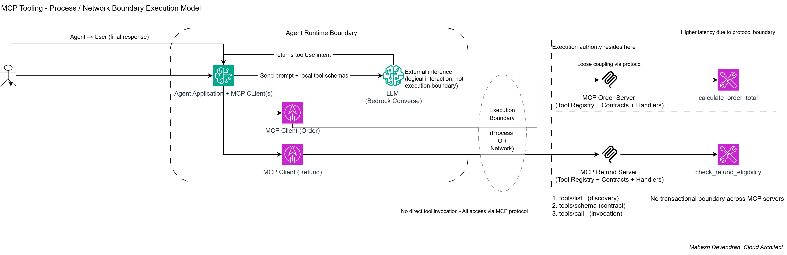

# Multi-MCP Server Architecture

This implementation demonstrates a single AI agent orchestrating tools across two independent MCP servers over stdio transport.

```text
Agent process
  -> MCP Client Session A
  -> stdio transport
  -> MCP Order Server
      -> calculate_order_total

Agent process
  -> MCP Client Session B
  -> stdio transport
  -> MCP Refund Server
      -> check_refund_eligibility
```

The agent orchestrates across MCP servers but does not execute tools locally. Each MCP server remains the execution authority for its own tools.

This implementation demonstrates composed MCP execution through orchestration of multiple MCP servers within the same agent loop.

This is not a separate execution pattern from MCP. It is MCP orchestration across multiple execution boundaries.

## Architecture Diagram



## Code

Files:

- `mcp_agent.py` - single orchestrating agent, two stdio MCP client sessions, tool discovery, ownership mapping, and routing.
- `mcp_order_server.py` - MCP server exposing only `calculate_order_total`.
- `mcp_refund_server.py` - MCP server exposing only `check_refund_eligibility`.

Run:

```powershell
pip install mcp boto3
$env:AWS_REGION = "eu-west-2"
$env:BEDROCK_MODEL_ID = "<bedrock-model-id-that-supports-tool-use>"
python .\mcp_agent.py success
python .\mcp_agent.py failure
```

Assumption: the configured Bedrock model supports tool use through the Converse API. Without `BEDROCK_MODEL_ID` and AWS credentials, the agent can still start both MCP servers and discover tools, but it cannot complete real LLM tool selection.

## Implementation Shape

The order server owns only the order tool:

```python
@mcp.tool()
def calculate_order_total(sku: str, quantity: int, unit_price: float) -> dict[str, Any]:
    logging.info("[MCP ORDER SERVER] Executing calculate_order_total")
    if not sku.startswith("SKU-"):
        raise ValueError("sku must start with SKU-")
    if quantity < 1:
        raise ValueError("quantity must be greater than or equal to 1")
    if unit_price <= 0:
        raise ValueError("unit_price must be greater than 0")
```

The refund server owns only the refund tool:

```python
@mcp.tool()
def check_refund_eligibility(order_id: str, days_since_purchase: int, item_opened: bool) -> dict[str, Any]:
    logging.info("[MCP REFUND SERVER] Executing check_refund_eligibility")
    if not order_id.startswith("ORD-"):
        raise ValueError("order_id must start with ORD-")
```

The agent starts both servers as independent child processes:

```python
order_mcp_client = await start_mcp_session(stack, "ORDER", ORDER_SERVER_FILE)
refund_mcp_client = await start_mcp_session(stack, "REFUND", REFUND_SERVER_FILE)
```

The agent discovers tools from both sessions and builds an ownership map:

```python
tool_owners[tool.name] = ToolOwner(label=label, session=session)
```

Example ownership:

```python
{
    "calculate_order_total": order_mcp_client,
    "check_refund_eligibility": refund_mcp_client,
}
```

The agent routes execution by ownership:

```python
owner = tool_owners.get(tool_name)
result = await owner.session.call_tool(tool_name, tool_input)
```

There is no local execution path in the agent. The agent imports MCP client APIs only; it does not import tool functions from either server.

## Expected Test Output

### Local Validation Performed

Syntax validation:

```powershell
python -m py_compile .\mcp_agent.py .\mcp_order_server.py .\mcp_refund_server.py
```

Result: passed.

Discovery validation without Bedrock credentials:

```powershell
python .\mcp_agent.py success
```

Observed boundary evidence before the expected Bedrock configuration failure:

```text
[AGENT] Starting MCP Order Server
[AGENT] ORDER server command: ... mcp_order_server.py
[AGENT] Initialising ORDER MCP client session
[MCP ORDER SERVER] Starting stdio server
[AGENT] Starting MCP Refund Server
[AGENT] REFUND server command: ... mcp_refund_server.py
[AGENT] Initialising REFUND MCP client session
[MCP REFUND SERVER] Starting stdio server
[AGENT -> ORDER MCP] tools/list
[ORDER MCP -> AGENT] tools/list returned 1 tools
[AGENT] Tool calculate_order_total owned by ORDER MCP server
[AGENT -> REFUND MCP] tools/list
[REFUND MCP -> AGENT] tools/list returned 1 tools
[AGENT] Tool check_refund_eligibility owned by REFUND MCP server
RuntimeError: Missing BEDROCK_MODEL_ID
```

This proves two separate server processes, two separate MCP client sessions, and independent `tools/list` discovery.

### Success Scenario

Prompt:

```text
Use the available MCP tools to do both tasks. First calculate the order total for SKU-BOOK-001 with quantity 3 and unit price 12.50. Then check refund eligibility for order ORD-1001 purchased 12 days ago where the item is not opened.
```

Expected logs:

```text
[LLM -> AGENT] Tool selected: calculate_order_total
[AGENT] Routing tool calculate_order_total to ORDER MCP server
[AGENT -> ORDER MCP] JSON-RPC request: tools/call params={"name": "calculate_order_total", ...}
Processing request of type CallToolRequest
[MCP ORDER SERVER] Executing calculate_order_total
[ORDER MCP -> AGENT] JSON-RPC response: tools/call result=... isError=False

[LLM -> AGENT] Tool selected: check_refund_eligibility
[AGENT] Routing tool check_refund_eligibility to REFUND MCP server
[AGENT -> REFUND MCP] JSON-RPC request: tools/call params={"name": "check_refund_eligibility", ...}
Processing request of type CallToolRequest
[MCP REFUND SERVER] Executing check_refund_eligibility
[REFUND MCP -> AGENT] JSON-RPC response: tools/call result=... isError=False
```

Expected final response:

```text
Order total is 45.00 and the order is refund eligible.
```

Local deterministic validation used a Bedrock-shaped fake `toolUse` response to exercise the agent loop without AWS credentials. Observed tool results:

```text
SUCCESS_TOOL_RESULTS_TO_LLM:
[
  {"toolResult": {"toolUseId": "order-1", "status": "success", "content": [{"json": {"mcp_server": "ORDER", "mcp_is_error": false, ...}}]}},
  {"toolResult": {"toolUseId": "refund-1", "status": "success", "content": [{"json": {"mcp_server": "REFUND", "mcp_is_error": false, ...}}]}}
]
```

### Failure Scenario

Prompt:

```text
Use the available MCP tools to do both tasks. First calculate the order total for SKU-BOOK-001 with quantity 3 and unit price 12.50. Then check refund eligibility for invalid order id BAD-1001 purchased 12 days ago where the item is not opened.
```

Expected logs:

```text
[AGENT] Routing tool calculate_order_total to ORDER MCP server
[MCP ORDER SERVER] Executing calculate_order_total
[ORDER MCP -> AGENT] JSON-RPC response: tools/call result=... isError=False

[AGENT] Routing tool check_refund_eligibility to REFUND MCP server
[MCP REFUND SERVER] Executing check_refund_eligibility
[REFUND MCP -> AGENT] JSON-RPC response: tools/call result=... isError=True
```

Expected final response:

```text
Order total succeeded, but refund validation failed because order_id must start with ORD-.
```

Local deterministic validation evidence:

```text
FAILURE_TOOL_RESULTS_TO_LLM:
[
  {"toolResult": {"toolUseId": "order-2", "status": "success", "content": [{"json": {"mcp_server": "ORDER", "mcp_is_error": false, ...}}]}},
  {"toolResult": {"toolUseId": "refund-2", "status": "error", "content": [{"json": {"mcp_server": "REFUND", "mcp_is_error": true, ...}}]}}
]
```

This proves isolated failure handling: the order MCP server succeeds, the refund MCP server rejects invalid input, and the agent returns both outcomes to the LLM without local tool execution.

## Architecture Explanation

### A. Tool Discovery and Wrapping

The agent calls `list_tools()` once per MCP client session:

- `ORDER` session returns only `calculate_order_total`.
- `REFUND` session returns only `check_refund_eligibility`.

Each tool definition includes name, description, and JSON input schema from the owning MCP server. The agent merges those schemas into a single Bedrock tool configuration so the LLM sees one tool menu while execution remains split across two boundaries.

The agent receives tool adapters/proxies, not implementations. The implementation functions remain in separate server files and separate server processes.

### B. MCPClient Capability

The agent maintains one MCP client session per server:

- ORDER MCP client session routes order tool calls over stdio to `mcp_order_server.py`.
- REFUND MCP client session routes refund tool calls over stdio to `mcp_refund_server.py`.

The `tool_name -> ToolOwner` map preserves the routing decision:

```python
tool_owners[tool.name] = ToolOwner(label=label, session=session)
```

The MCP clients do not execute business logic. They send `tools/call` over the configured stdio transport to the owning MCP server.

### C. Execution Model

Precise trace:

1. User sends a multi-step request to the agent.
2. Agent sends prompt plus merged MCP-discovered schemas to the LLM.
3. LLM emits one or more `toolUse` blocks.
4. Agent intercepts each tool call.
5. Agent looks up the owning MCP client session by tool name.
6. Agent routes `calculate_order_total` to ORDER MCP.
7. ORDER MCP client sends `tools/call` over stdio to the order server.
8. Order server validates and executes the order tool.
9. Agent routes `check_refund_eligibility` to REFUND MCP.
10. REFUND MCP client sends `tools/call` over stdio to the refund server.
11. Refund server validates and executes the refund tool.
12. Agent returns both MCP results to the LLM.
13. LLM produces the final response.

Clarifications:

- The LLM does not execute tools.
- The agent does not execute tools locally.
- Each MCP server is the execution authority for its own tool.
- Execution is distributed across multiple stdio process boundaries.

### D. Tool Contract Location

- `calculate_order_total` schema and validation live in `mcp_order_server.py`.
- `check_refund_eligibility` schema and validation live in `mcp_refund_server.py`.
- LLM visibility is limited to merged schemas and descriptions.
- The agent owns orchestration only.

### E. Trust Boundary

Boundary definition:

- Agent to ORDER MCP: stdio process boundary.
- Agent to REFUND MCP: stdio process boundary.

Implications:

- The order server and refund server have independent processes and MCP sessions.
- A server-side validation failure in one execution domain is returned as that server's tool error.
- The agent can continue collecting and returning results from other MCP servers.

### F. Failure Model

Failure points:

- Order MCP server unavailable.
- Refund MCP server unavailable.
- Stdio transport failure for one server.
- Duplicate tool names during discovery.
- Server-side schema or validation failure.
- Tool runtime exception in one server.
- Bedrock configuration or service failure.

The implemented failure scenario uses refund server validation:

- ORDER MCP returns `isError=False`.
- REFUND MCP returns `isError=True`.
- Agent marks the refund tool result as `status: "error"`.
- Agent returns both results to the LLM.

This demonstrates independent failure domains at the tool-execution level.

### G. Security Implications

Enforced by this implementation:

- No local tool execution in the agent.
- Tool implementation is isolated in separate MCP server processes.
- Each server validates its own inputs.
- The LLM sees schemas, not implementation functions.

Not enforced:

- Identity-based authorization.
- Per-user tool permissions.
- TLS, because this sample uses local stdio transport only.
- Prompt-injection resistance beyond schema and server-side validation.
- Data-loss prevention for sensitive tool results.

Risks:

- Prompt injection can cause the LLM to select inappropriate tools or arguments.
- A tool can expose sensitive data if its server-side implementation allows it.
- The agent's merged tool menu does not by itself enforce policy.

### H. Operational Considerations

Deployment:

- Each MCP server can be packaged, tested, and released independently.
- This sample starts both servers as child processes from the agent.

Scalability:

- With stdio, each agent instance owns its child server processes.
- Tool execution domains are separated, but child process count scales with agent instances.

Observability:

- Agent logs show startup, discovery, ownership mapping, and routing.
- Server logs show execution authority for each tool.
- Boundary proof requires correlating agent routing logs with server execution logs.

Versioning:

- Each server owns its schema.
- Contract drift is detected by `tools/list` contract tests.
- Duplicate tool names are rejected by the agent during discovery.

Testing:

- Contract tests: assert each server exposes exactly one expected tool.
- Integration tests: assert tool routing uses the owning MCP client session.
- Failure tests: assert a refund validation error does not prevent order tool success.

### I. Suitability

Appropriate when:

- a single agent must orchestrate tools owned by different teams or domains
- tools need independent validation and lifecycle
- article or system design needs visible execution boundaries
- composed workflows should remain protocol-mediated

Avoid when:

- tools are trivial and do not need boundary proof
- per-agent child process overhead is unacceptable
- tool names cannot be kept unique
- strong identity, policy, or network security is required but not implemented

## Proof Summary

Proven:

- The agent starts two separate MCP server processes.
- The agent creates two separate MCP client sessions.
- `calculate_order_total` is discovered only from ORDER MCP.
- `check_refund_eligibility` is discovered only from REFUND MCP.
- The agent merges schemas into one LLM-visible tool configuration.
- The agent routes each selected tool to its owning MCP session.
- ORDER MCP executes only the order tool.
- REFUND MCP executes only the refund tool.
- Refund validation failure is isolated while order execution succeeds.
- The agent remains an orchestration layer and does not execute tools locally.

Not proven:

- Real Bedrock tool selection in the local validation environment, because `BEDROCK_MODEL_ID` and AWS credentials were not available.
- Network transport, gateway behavior, or TLS.
- Identity enforcement or authorization.
- Independent horizontal scaling beyond the local stdio process model.
- Production tracing, metrics, or audit logging.
