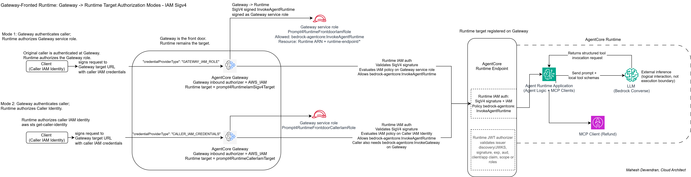
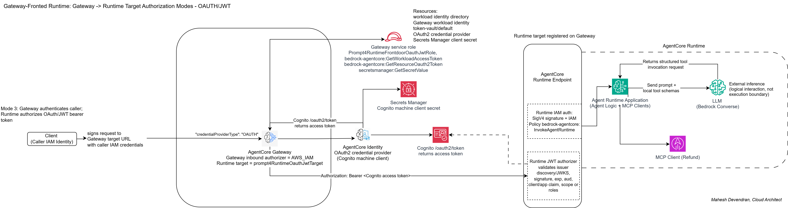
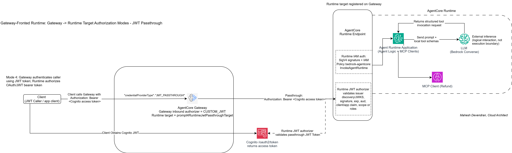
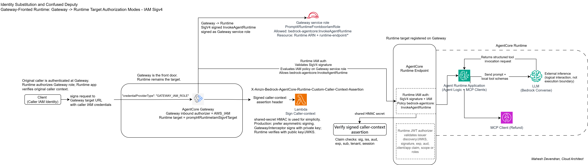

# Gateway-Fronted Runtime Runbooks

These scenarios test AgentCore Gateway as the front door to AgentCore Runtime:

```text
source -> AgentCore Gateway -> AgentCore Runtime target
```

This is different from the MCP tool Gateway path:

```text
Runtime -> MCP Client -> AgentCore Gateway -> Lambda/API tool target
```

Do not reuse the MCP tools Gateway for these scenarios. A Gateway-fronted Runtime target uses a Gateway without MCP protocol configuration and points to a Runtime target.

## Architecture Diagrams







When substitution modes are used, preserve original caller context deliberately:



## Authorization Modes

| # | Scenario | Gateway inbound auth | Runtime target credential provider | Runtime authorizes |
|---|---|---|---|---|
| G1 | `gateway_fronted_runtime_iam_sigv4` | `AWS_IAM` | `GATEWAY_IAM_ROLE` | Gateway service role |
| G2 | `gateway_fronted_runtime_caller_iam` | `AWS_IAM` | `CALLER_IAM_CREDENTIALS` | Original caller IAM identity |
| G3 | `gateway_fronted_runtime_oauth_jwt` | `AWS_IAM` | `OAUTH` | Gateway-obtained Cognito JWT |
| G4 | `gateway_fronted_runtime_jwt_passthrough` | `CUSTOM_JWT` | `JWT_PASSTHROUGH` | Original caller JWT |

Gateway is the front door in all four modes, but Runtime remains the target and final authorization boundary. Modes G1 and G3 use Gateway-carried credentials at Runtime. Modes G2 and G4 preserve caller-carried identity at Runtime.

## Identity Propagation vs Substitution

| Mode | Runtime-facing identity | Category |
|---|---|---|
| `GATEWAY_IAM_ROLE` | Gateway service role | Substitution |
| `CALLER_IAM_CREDENTIALS` | Original IAM caller | Propagation |
| `OAUTH` | Gateway-obtained OAuth/JWT token | Substitution |
| `JWT_PASSTHROUGH` | Original caller bearer token | Propagation |

Substitution modes are valid, but they can hide original caller context unless the architecture preserves it deliberately. This is the confused deputy risk: Runtime authorizes a trusted Gateway or machine credential, while the business action may have been initiated by a different caller. When caller attribution, tenant policy, or business authorization must survive substitution, carry a signed caller-context assertion alongside the Runtime-facing identity.

Evidence:

- `../caller_context_assertion.py` - dependency-light sign/verify helper.
- `../caller_context_demo/` - runnable demo where a Runtime-side `who_am_i` tool verifies caller context while Runtime-facing identity remains `GatewayServiceRole`.
  - Client-signed payload path: Runtime validates an assertion carried in the JSON payload.
  - Gateway-signed header path: Gateway REQUEST interceptor signs caller context, Gateway propagates `X-Amzn-Bedrock-AgentCore-Runtime-Custom-Caller-Context-Assertion`, and Runtime reads it through the request header allowlist.

For production, prefer asymmetric caller-context signing: Gateway or a Gateway-adjacent interceptor holds the private signing key, while Runtime verifies with a public key or JWKS. The demo also includes symmetric HMAC signing for local evidence because it is simple to run.

## Current SDK/CLI Support Check

The Python setup script uses boto3/botocore. Version 1.43.14 exposes Gateway HTTP Runtime targets:

Run:

```bash
python gateway_fronted_runtime/iam_sigv4_setup.py --check-only
```

Expected result:

```text
supports_gateway_without_protocol_type: true
supports_http_agentcore_runtime_target: true
```

If `ready_for_deploy` is false, export `AGENT_RUNTIME_ARN_IAM` or pass `--runtime-arn`.

## G1. Gateway Service Role IAM/SigV4

Trust chain:

```text
1. Client authenticates to AgentCore Gateway.
2. Gateway accepts the inbound request.
3. Gateway uses its Gateway service role.
4. Gateway signs InvokeAgentRuntime with SigV4.
5. Runtime IAM auth validates the signed request.
6. IAM policy on the Gateway role must allow bedrock-agentcore:InvokeAgentRuntime on the Runtime ARN and endpoint ARN.
7. Runtime invokes the hosted agent application.
```

Desired Runtime target shape:

```json
{
  "http": {
    "agentcoreRuntime": {
      "arn": "<runtime-arn>"
    }
  }
}
```

Desired target credential provider:

```json
[
  {
    "credentialProviderType": "GATEWAY_IAM_ROLE"
  }
]
```

Gateway service role policy:

```json
{
  "Action": "bedrock-agentcore:InvokeAgentRuntime",
  "Resource": [
    "<runtime-arn>",
    "<runtime-arn>/runtime-endpoint/*"
  ]
}
```

Setup command:

```bash
python gateway_fronted_runtime/iam_sigv4_setup.py
```

To verify local support without creating resources, use:

```bash
python gateway_fronted_runtime/iam_sigv4_setup.py --check-only
```

Test command:

```bash
python gateway_fronted_runtime/invoke_iam_sigv4.py --runtime-arn "$AGENT_RUNTIME_ARN_IAM"
```

The test client signs the request to the Gateway with IAM/SigV4. Gateway then signs the target Runtime invocation with the Gateway service role.

## G2. Caller IAM Credentials

Trust chain:

```text
1. Client signs request to Gateway target URL with caller IAM credentials.
2. Gateway authenticates the caller with AWS_IAM.
3. Gateway signs the Runtime target request using caller IAM credentials.
4. Runtime IAM auth evaluates the original caller identity.
```

This mode requires the caller to have both permissions:

```text
bedrock-agentcore:InvokeGateway
bedrock-agentcore:InvokeAgentRuntime
```

Setup command:

```bash
python gateway_fronted_runtime/caller_iam_setup.py --runtime-arn "$AGENT_RUNTIME_ARN_IAM"
```

If you want to reuse the existing scenario 1 allow role as the caller, attach both permissions:

```bash
python gateway_fronted_runtime/caller_iam_setup.py \
  --runtime-arn "$AGENT_RUNTIME_ARN_IAM" \
  --caller-allow-role-arn "$PROMPT4_CLIENT_RUNTIME_IAM_ROLE_ALLOW_ARN"
```

Target credential provider:

```json
{
  "credentialProviderType": "CALLER_IAM_CREDENTIALS",
  "credentialProvider": {
    "iamCredentialProvider": {
      "service": "bedrock-agentcore",
      "region": "eu-west-2"
    }
  }
}
```

The Gateway service role is primarily trust and routing infrastructure here; Runtime authorization is evaluated against the original caller IAM identity.

## G3. AgentCore Identity OAuth/JWT

Trust chain:

```text
1. Client signs request to Gateway target URL with caller IAM credentials.
2. Gateway authenticates the caller with AWS_IAM.
3. Gateway obtains OAuth access token through AgentCore Identity credential provider.
4. Gateway invokes Runtime target with Authorization: Bearer <token>.
5. Runtime JWT authorizer validates the token.
```

Setup command:

```bash
python gateway_fronted_runtime/oauth_jwt_setup.py --runtime-arn "$AGENT_RUNTIME_ARN_OAUTH_CLIENT"
```

Test command:

```bash
python gateway_fronted_runtime/invoke_target_http.py --env-file gateway_fronted_runtime_oauth_jwt.env
```

Target credential provider:

```json
{
  "credentialProviderType": "OAUTH",
  "credentialProvider": {
    "oauthCredentialProvider": {
      "providerArn": "<oauth2-credential-provider-arn>",
      "scopes": ["agentcore-runtime/invoke"],
      "grantType": "CLIENT_CREDENTIALS"
    }
  }
}
```

The Gateway service role also needs permission to retrieve OAuth tokens through AgentCore Identity:

```text
bedrock-agentcore:GetWorkloadAccessToken
bedrock-agentcore:GetResourceOauth2Token
secretsmanager:GetSecretValue
```

The resources include the Gateway workload identity directory, the Gateway workload identity, the AgentCore token vault, the OAuth2 credential provider, and the secret that stores the OAuth client secret.

Secrets Manager is used in this mode because the Cognito machine-client secret has to be stored for AgentCore Identity. It is not part of G1, G2, or G4.

## G4. JWT Passthrough

Trust chain:

```text
1. Client obtains a JWT access token.
2. Client calls Gateway target URL with Authorization: Bearer <token>.
3. Gateway CUSTOM_JWT authorizer validates the token.
4. Gateway passes the same bearer token to Runtime.
5. Runtime JWT authorizer performs final authorization.
```

Setup command:

```bash
python gateway_fronted_runtime/jwt_passthrough_setup.py --runtime-arn "$AGENT_RUNTIME_ARN_OAUTH_CLIENT"
```

Test command:

```bash
python gateway_fronted_runtime/invoke_jwt_passthrough.py
```

Target credential provider:

```json
{
  "credentialProviderType": "JWT_PASSTHROUGH"
}
```

Runtime authorizer configuration must match the same issuer, audience/client claim, and scope/roles that Gateway validates for the inbound token. If Gateway accepts a token but Runtime is configured for a different issuer or claim shape, Runtime should still deny the call.

The Gateway service role is mostly trust-only in this mode, similar to G2. It does not retrieve a client secret or mint a replacement token.
