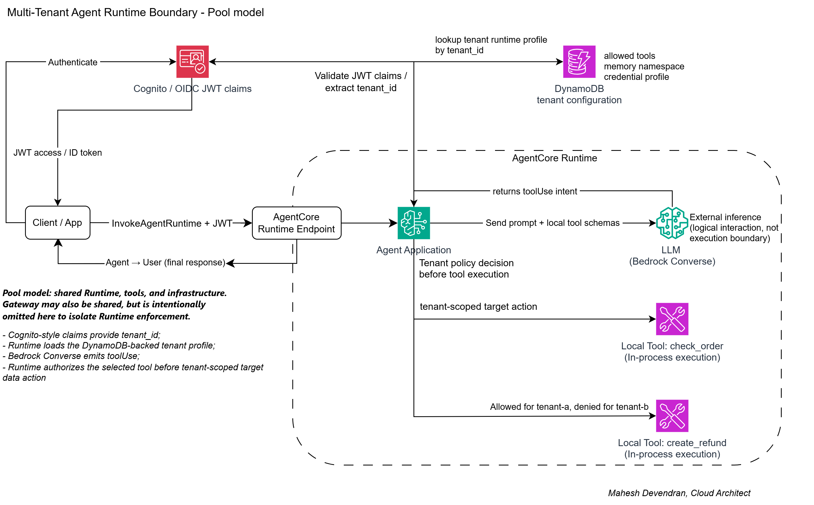

# Multi-Tenant Agent Runtime Boundaries

This folder models a pooled multi-tenant agent runtime pattern using Cognito-style tenant claims and DynamoDB-style tenant configuration and tenant data. The purpose is to show that tenant context is consumed by the Runtime orchestration layer after identity has already been verified.



Identity validation is covered in `identity_trust/`. This pattern focuses on what the verified tenant is allowed to do once Runtime trusts the caller context.

## Architecture Point

A shared agent runtime can serve multiple tenants only if tenant context is enforced before tool orchestration begins. Tenant identity should come from a trusted boundary such as IAM, JWT claims, Gateway policy, or a verified caller-context assertion. It should not come from the prompt or from model output.

Runtime uses the verified Cognito tenant claim to load the tenant runtime profile from the DynamoDB-style tenant configuration table:

```text
Cognito JWT claims -> tenant_id -> DynamoDB tenant configuration -> Runtime orchestration decision
```

The tenant runtime profile includes the allowed tool catalog, memory namespace, rate-limit tier, outbound credential profile, and model profile. Tool handlers access only the DynamoDB-style user data partition for the verified tenant. The model can reason within tenant context, but it does not create, switch, or authorize tenant context.

## Boundary Evidence

Run from the repository root:

```bash
python multi_tenant_agents/run_evidence.py
```

Expected decisions:

```text
tenant-a -> create_refund -> allowed
tenant-b -> check_order -> allowed
tenant-b -> create_refund -> denied
```

The denied case is the important boundary evidence. Runtime rejects the tool request before MCP, Gateway, or downstream execution. The model can ask; Runtime decides.

## AgentCore Runtime with LLM

`runtime_with_llm.py` packages the same tenant controls behind AgentCore Runtime and places Bedrock Converse in front of the tool boundary:

```text
Client
-> AgentCore Runtime
-> Bedrock Converse selects toolUse
-> Runtime loads tenant profile from Cognito claim + DynamoDB-style tenant config
-> Runtime allows or denies tool execution
-> Runtime returns toolResult to Bedrock Converse
```

Deploy:

```bash
export AWS_REGION="eu-west-2"
export BEDROCK_MODEL_ID="<bedrock-model-id-with-tool-use-support>"
python multi_tenant_agents/deploy_runtime.py
```

Invoke evidence:

```bash
export MULTI_TENANT_RUNTIME_ARN="<runtime-arn-from-deploy>"
python multi_tenant_agents/invoke_runtime.py --mode tenant-a-refund
python multi_tenant_agents/invoke_runtime.py --mode tenant-b-check
python multi_tenant_agents/invoke_runtime.py --mode tenant-b-refund-denied
```

The Runtime logs include `multi_tenant_tool_decision` with tenant, subject, tool, decision, execution flag, and correlation id.

## Files

- `cognito_claims.py` simulates verified Cognito JWT claims containing `sub`, tenant claim, audience, issuer, and scope.
- `dynamodb_tenant_store.py` simulates a DynamoDB tenant configuration table and tenant-partitioned user data.
- `tenant_tool_policy.py` defines a tenant-to-tool authorization catalog.
- `pooled_runtime_demo.py` models the Runtime orchestration decision after caller context has been verified.
- `run_evidence.py` runs good and bad tenant/tool combinations.
- `runtime_with_llm.py` runs the same policy after Bedrock Converse emits a `toolUse`.
- `deploy_runtime.py` deploys the LLM-backed Runtime to AgentCore Runtime.
- `invoke_runtime.py` invokes the deployed Runtime and validates good and denied outcomes.

## Article Mapping

This evidence supports the multi-tenant agent section:

- Gateway can govern which capabilities are exposed to runtimes.
- Runtime must still enforce tenant-aware orchestration.
- Tenant context must be verified before tool selection.
- Tool catalogs, memory scope, rate limits, outbound credentials, and audit context should be selected from verified tenant context.
- The prompt and model output must not be trusted to establish or switch tenant context.

## Scope

This is pooled-runtime orchestration evidence, not a complete SaaS tenant isolation implementation. Production systems also need tenant-aware data access policies, memory isolation, scoped outbound credentials, tenant or tier-based throttling, audit attribution, cost allocation, and noisy-neighbor controls at every shared component.
